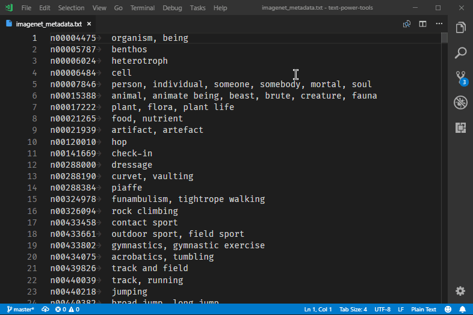
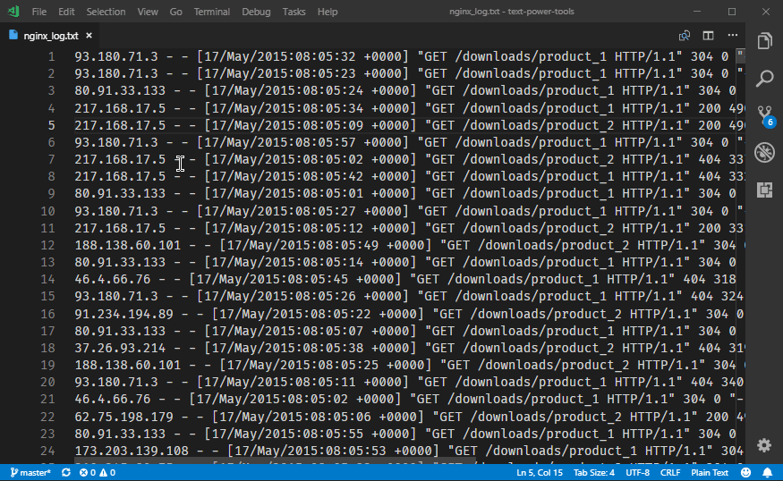
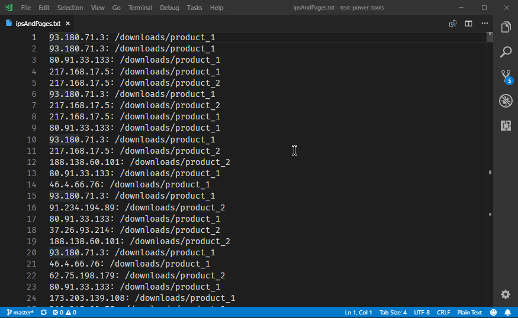
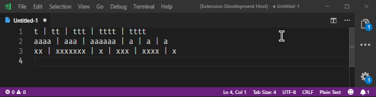

# Text Power Tools

Text Power Tools is an all-in-one text manipulation extension for VS Code inspired by _TextFX_ for Notepad++ and _Filter Lines_ and _Text Pastry_ for Sublime Text. All commands supports multiple selections where it is applicable, and many of them can target new documents, so the original source remains unchanged.

All features are available from either the *Command Palette* or the editor context menu. To access the commands from the Command Palette use `Ctrl+Shift+P`, and enter `tpt` or part of your favourite Text Power Tool command name (e.g. `filter`, `guid` etc.) to quickly access the list of available commands. Almost all commands are available from the editor context menu, which is accessible from the *Text Power Tools* submenu after right clicking in the editor area.

Availability:
* **VS Code Marketplace:** https://marketplace.visualstudio.com/items?itemName=qcz.text-power-tools
* **OpenVSX:** https://open-vsx.org/extension/qcz/text-power-tools

Text Power Tools is also available as a Web Extension so it can be used on sites like vscode.dev.

**Note:** Due to current architectural limitations of VSCode, no extension can access files larger than 50 Megabytes. Vote for [VSCode issue 31078](https://github.com/Microsoft/vscode/issues/31078), which once implemented, will allows this extension to work with these large files. In the meantime you can trick VSCode by opening a new file and copying the content of the large file there (without saving).

## Features
* **Filter lines using strings or regular expressions (grep like experience):** Filter line commands take an input – a raw text, a regular expression or the selected text – and filter – exclude or include – the selected lines using that input. It works like the `grep` command but inside VS Code.
    * *Protip:* The command provides a history feature with the last 10 filter texts available to use immediately.
    * *Protip:* Filter commands can project the results to a new editor, so the original content is not modified. This way you can create multiple projections from your content without reloading the file or reverting the changes made by the filter command. Search for commands with `into a new editor` at the end to use this feature.
    * *Protip:* There are commands to copy or cut resulting lines to the clipboard.
    * *Protip:* These commands search/match in a case insensitive manner. To use case sensitive search/match, set the value of the `textPowerTools.caseSensitiveFiltering` setting to `true`.
* **Change case of text (camelCase, PascalCase, snake_case, CONSTANT_CASE, dash-case, dot.case, Title Case, sPoNgE cAsE) and swap casing**.
    * *Note:* *UPPER CASE* and *lower case* is not implemented in this extension as it is available in VS Code by default via the *Transform to Title Case*, *Transform to Uppercase* and *Transform to Lower Case* commands.
* **Separate words with spaces, forward slashes and backslashes**
* **Slugify and latizine text** (latinize removes all diacritic characters)
* **Insert decimal, hexadecimal and Roman numbers:** Inserts increasing/decreasing decimal, hex or Roman numbers. You can even specify the starting number and the step size for them. You can use one selection and it will prompt for how many elements to insert, or you can use multiple selections and it will insert the a number from the sequence into every selection.
    * *Protip:* When inserting hex numbers, by default they will be uppercase. To insert lowercase hex numbers, set the value of the `textPowerTools.insertUppercaseHexNumbers` setting to `false`.
* **Convert numbers from decimal to hexadecimal and vice versa**
* **Insert series of items from predefined list of items**: Inserts sequence of items from a predefined set. You can use one selection and it will prompt for how many elements to insert, or you can use multiple selections and it will insert the a number from the sequence into every selection. Currently the following predefined sequences are supported:
    * _Uppercase letters_
    * _Lowercase letters_
    * _Uppercase Greek letters_
    * _Lowercase Greek letters_
    * _NATO phonetic alphabet_
    * _Long english month names_
    * _Short english month names_
    * _Long english day names_
    * _Short english day names_
    * _Long current/custom locale month names_
    * _Short current/custom locale month names_
    * _Long current/custom locale day names_
    * _Short current/custom locale day names_

    (Note: current/custom locale means OS locale or the locale specified in the `textPowerTools.customLocale` setting)
* **Generate fake/random data**:
    * _Random decimal, hexadecimal and real numbers from range_
    * _Random hex/decimal character sequences_
    * _Fake first names, last names and full names_ in the following languages: English, French, German and Hungarian.
    * _GUIDs/UUIDs_ (globally unique identifiers or universally unique identifiers) using multiple predefined formats (no dashes, dashes, dashes and braces, C# Guid constructor).
        * To insert GUIDs with uppercase hex characters, set the value of the `textPowerTools.insertUppercaseGuids` setting to `true`. The default GUID style can be set using the `textPowerTools.defaultGuidType` setting.
    * _IPv4 and Ipv6 addresses_
    * _WGS84 coordinates_, including generators for specific continents (some are available as a direct fucnction and all are available via the _Generate fake/random data..._ command).
    * _Lorem ipsum sentences_
    * _Lorem ipsum paragraphs_
    * _From comma separated list of items provided by the user_
* **Pad start and end of strings:** Pad the start or the end of selections to the desired length with default or custom character sequences. The default pad string can be customized with the `textPowerTools.defaultPadString` setting.
* **Insert line numbers:** Inserts line numbers to the start of each line in every selection. Line numbers can be real line numbers in the file or can start with 1.
* **Remove duplicated, adjacent duplicated, blank, surplus blank, empty, surplus empty lines and control characters**
* **Keep only duplicated**, **unique**, or **a number or percentage of random** lines
* **Replace new lines and whitespace with a single space** and **replace whitespace with a single space**
* **Split lines** by spaces, semicolons, commas, pipes or any custom string.
* **Join every two or N lines** (using only the raw lines or glue them together with spaces, semicolons, commas, pipes or any custom string)
* **Trim leading & trailing whitespace, remove whitespace characters, remove newlines**
    * *Note*: There are disabled by default built-in settings for trimming trailing whitespace and secondary newlines at the end of file:
    * - `files.trimTrailingWhitespace` – When `true`, will trim trailing whitespace when saving a file.
    * - `files.trimFinalNewlines` – When `true`, will trim all new lines after the final new line at the end of the file when saving it.
* **Prefix, suffix and wrap lines:** Prefix, suffix and wrap lines. Wrap uses either the same prefix/suffix or different ones.
* **Insert full file path, directory path and file name of the opened file**.
* **Escape/unescape text for JSON and convert text to JSON string**
* **Insert timestamp** formatted using the editor or a custom locale; insert a **UTC timestamp** using the ISO 8601 format, or insert the current **Unix timestamp**.
* **Extract information from the source lines using regular expressions:** First input is the regular expression which should be matched with capture groups to find the desired parts of the lines (e.g.: `(\d.\d) dogs`). The second input is the replacement rule, which should contain capture group references (e.g. `$1 cats`). You can insert newlines with `\n` to the output. With these commands you can transform matching lines to the desired format in seconds.

  The last 10 filter strings and replacement expressions are presented and can be used quickly when executing these commands.
* **Count occurrences of lines:** This command will counts how many times a line appears in the selected text and generates an output with the number of occurrences and the lines themselves.
* **Count adjacent duplicated lines:** This command will counts how many times adjacent duplicated lines appears in the selected text. Generates the same output as the standard count occurrences command.
* **Various sorting methods which all supports ascending and descending orders**
    * _Case sensitive sort lines_
    * _Case sensitive sort lines starting at column_
    * _Case insensitive sort lines starting at column_
    * _Sort lines by length (and then case sensitive)_
    * _Sort lines by length (and then case insensitive)_
    * _Sort lines by semver rules_
    * _Sort lines by word count_
    * _Sort lines by grapheme count_ (taking care of surrogate pairs and combining marks thanks to Voca)
    * _Sort lines containing IP addresses_ (including CIDR ranges)
    * _Sort lines by decimal/hexadecimal value_
* **Shuffle lines**
    * There are additional commands to convert between them using 8, 16, 32 and 64 bit arithmetic
* **Increase/decrease decimal and hexadecimal numbers**
    * There are commands to increase and decrease with 1 and with a custom increment.
    * There are additional commands to increase/decrease hexadecimal numbers using 8, 16, 32 and 64 bit arithmetic.
* **Format content as table** by splitting text to pieces by predefined or custom characters or strings and formatting them as a table with equal length columns using space characters.

  Text can be splitted by tabulators, semicolons, commas, pipes or any custom character sequences.
* **Spread paste lines from clipboard** including support for skipping empty lines and pasting lines repeatedly if there are fewer lines on the clipboard than selections.
* **Text slots**, which are permanent clipboard entries in your VS Code. There are 5 of them. You can store a text in one of these slots with a command, for example *Set text slot 1 content*, and paste it with *Paste text slot 1 content* later. Recommended to bind the paste commands you use to a key combo of your choice for the quick usage.
* **Encode and decode various encoding formats**: URL encode, HTML entities, XML entities, Base64 and unicode escape sequences
* **Convert to Unicode normalization forms (NFC, NFD, NFKC, NFKD)**
* **Convert to Zalgo text**
* **Copy content of selections to a new editor**
* **Duplicate and repeat selection content**
## Showcase

### Filtering in action

Description:
* Opening the VS Code Command Palette with `Ctrl+Shift+P`
* Entering `filter`, so Text Power Tools' filter commands are displayed
* Selecting the `Text Power Tools: Filter lines including string into a new editor` command
* Entering `tiger` as the filter text
* The command runs and pipes the result into a new editor

### Extracting information in action

### Counting the number of occurrences

### Formatting text as table

## Localization

Text Power Tools is fullly localizable. You have to translate the following two files:
* `package.nls.json`
* `l10n/bundle.l10n.json`.

Translations provided by the community:
* Brazilian Portuguese (@thiagojramos)
* Japanese (@wany-oh)

## Requirements

The extension requires at least version 1.75 of Visual Studio Code or other open source derivatives of it.

## License

MIT

Sample images use text files from the [Elasticsearch Examples](https://github.com/elastic/examples) and [TensorFlow Models](https://github.com/tensorflow/models) projects. Both are under the Apache 2.0 License.

## My other extensions
* **Restart TS server Status Bar button** – Convenient button on the Status Bar for restarting TS server: [VS Code Marketplace](https://marketplace.visualstudio.com/items?itemName=qcz.restart-ts-server-button) / [OpenVSX](https://open-vsx.org/extension/qcz/restart-ts-server-button)
