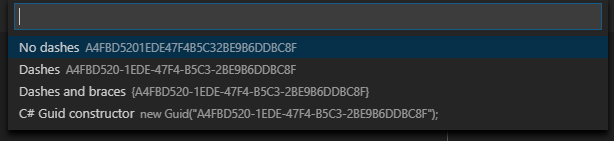

# Text Power Tools

Text Power Tools is an extension for text manipulation inspired by _TextFX_ for Notepad++ and _Filter Lines_ for Sublime Text. All commands supports multiple selections where it is applicable, and many of them can target new documents, so the original source remains unchanged.

Overview of features:
* Filtering lines using strings or regular expressions (grep like experience), even into new editors
* Extracting information from text using regular expressions, even into new editors
* Remove duplicated lines and extra empty lines
* Count occurrences of lines
* Insert decimal and hex number sequences
* Insert line numbers
* Generate GUIDs
* Change case of text (camelCase, PascalCase, snake_case, CONSTANT_CASE, dash-case, dot.case) and swap casing
* Pad start and end of strings
* Copy content of selections to a new editor

**Note:** Due to current architectural limitations of VSCode, no extension can access files larger than 50 Megabytes. Vote for [VSCode issue #31078](https://github.com/Microsoft/vscode/issues/31078), which once implemented, will allows this extension to work with these large files. In the meantime you can trick VSCode by opening a new file and copying the content of the large file there (without saving).

## Features

### Filtering lines (grep)

Filter line commands take an input (a raw text or a regular expression) and filter the selected lines based on whether to include or exclude the them. They work like `grep` but inside VS Code. These commands search/match in a case insensitive manner. To use case sensitive search/match, set the value of the `textPowerTools.caseSensitiveFiltering` setting to `true`.

The last 10 filter strings and regular expressions are presented and can be used quickly when executing these commands.

| Command | Input | Description | Selection support |
| ------- | ----- | ----------- | ------------------|
| **Filter lines including string** | Raw text | Replaces the content of all selections (or the full document if nothing is selected) with only the lines which include the input string. | Supports multiple selections. Works on the full document if nothing selected.
| **Filter lines including string into a new editor** | Raw text | Creates a new document with the lines which include the input string. | Supports multiple selections. Works on the full document if nothing selected.
| **Filter lines matching a regex (grep)** | Regular expression | Replaces the content of all selections (or the full document if nothing is selected) with only the lines which match the regular expression. | Supports multiple selections. Works on the full document if nothing selected.
| **Filter lines matching a regex (grep) into a new editor** | Regular expression | Creates a new document with the lines which match the regular expression. | Supports multiple selections. Works on the full document if nothing selected.
| **Filter lines not including string** | Raw text | Replaces the content of all selections (or the full document if nothing is selected) with only the lines which do not include the input string. | Supports multiple selections. Works on the full document if nothing selected.
| **Filter lines not including string into a new editor** | Raw text | Creates a new document with the lines which do not include the input string. | Supports multiple selections. Works on the full document if nothing selected.
| **Filter lines not matching a regex (grep)** | Regular expression | Replaces the content of all selections (or the full document if nothing is selected) with only the lines which do not match the regular expression. | Supports multiple selections. Works on the full document if nothing selected.
| **Filter lines not matching a regex (grep) into a new editor** | Regular expression| Creates a new document with the lines which do not match the regular expression. | Supports multiple selections. Works on the full document if nothing selected.

### Extracting information from text

Extract information from the source lines using regular expressions. First input is the regular expression which should be matched with capture groups to find the desired parts of the lines. The second input is the replacement rule, which should contain capture group references. With these commands you can transform matching lines to the desired format in seconds.

The last 10 filter strings and replacement expressions are presented and can be used quickly when executing these commands.

| Command | Input | Description | Selection support |
| ------- | ----- | ----------- | ------------------|
| **Extract information from text** | Regular expression and a replacement rule | Extracts captured information and transforms matching lines to the desired format. | Supports multiple selections. Works on the full document if nothing selected.
| **Extract information from text into a new editor** | Regular expression and a replacement rule | Creates a new document with extracted and transformed information from the original document. | Supports multiple selections. Works on the full document if nothing selected.

### Counting line occurrences

| Command | Input | Description | Selection support |
| ------- | ----- | ----------- | ------------------|
| **Count line occurrences** | _none_ | Counts line occurrences and transforms the selections/document to show the resuls. The result contains two columns, the line count and the actual line separated with a tabulator.
| **Count line occurrences into a new editor** | _none_ | Counts line occurrences and creates a new document to show the resuls. The result contains two columns, the line count and the actual line separated with a tabulator.

### Removing lines and content

| Command | Input | Description | Selection support |
| ------- | ----- | ----------- | ------------------|
| **Remove duplicated lines** | _none_ | Removes all duplicates of lines, so only the first occurrence remains in the document or selections. | Supports multiple selections. Works on the full document if nothing selected.
| **Remove blank lines** | _none_ | Removes all blank lines from the document or selections. | Supports multiple selections. Works on the full document if nothing selected.
| **Remove surplus blank lines** | _none_ | Removes surplus blank lines if there are two or more are in the document or selections consecutively. | Supports multiple selections. Works on the full document if nothing selected.
| **Remove control characters** | _none_ | Removes ASCII control characters from the text | Supports multiple selections. Works on the full document if nothing selected.

### Format content as table
Format content as table by splitting text to pieces by predefined or custom characters or strings and formatting them as a table with equal length columns using space characters.

| Command | Input | Description | Selection support |
| ------- | ----- | ----------- | ------------------|
| **Format content as table using tabulator as splitter** | _none_ | Formats content as table by aligning content at tabulator characters. | Supports multiple selections.
| **Format content as table using semicolon as splitter** | _none_ | Formats content as table by aligning content at semicolon characters. | Supports multiple selections.
| **Format content as table using comma as splitter** | _none_ | Formats content as table by aligning content at comma characters. | Supports multiple selections.
| **Format content as table using pipe as splitter** | _none_ | Formats content as table by aligning content at pipe characters. | Supports multiple selections.
| **Format content as table using custom string as splitter** | Character or string to split by | Formats content as table by aligning content at the characters or strings enetered by the user. | Supports multiple selections.
| **Format content as table using semicolon as splitter (with padding)** | _none_ | Formats content as table by aligning content at semicolon characters. Inserts additional space characters around the splitter character. | Supports multiple selections.
| **Format content as table using pipe as splitter (with padding)** | _none_ | Formats content as table by aligning content at pipe characters. Inserts additional space characters around the splitter character. | Supports multiple selections.
| **Format content as table using custom string as splitter (with padding)** | Character or string to split by | Formats content as table by aligning content at the characters or strings enetered by the user. Inserts additional space characters around the splitter character or string. | Supports multiple selections.

### Insert number sequence
Inserts sequence o decimal or hex numbers to every selection. When inserting hex numbers, by default they will be uppercase. To insert lowercase hex numbers, set the value of the `textPowerTools.insertUppercaseHexNumbers` setting to `false`.

| Command | Input | Description | Selection support |
| ------- | ----- | ----------- | ------------------|
| **Insert decimal number sequence** | _none_ | Inserts incremental decimal numbers starting with 1 to every selection. | Supports multiple selections.
| **Insert decimal number sequence starting at...** | Starting number in decimal format | Inserts incremental decimal numbers starting with the number provided by the user to every selection. | Supports multiple selections.
| **Insert decimal number sequence with custom increments** | Increment in decimal format | Inserts incremental decimal numbers using custom increments starting with 1 to every selection. | Supports multiple selections.
| **Insert decimal number sequence with custom increments starting at...** | Starting number and increment in decimal format | Inserts incremental decimal numbers using custom increments starting with the number provided by the user to every selection. | Supports multiple selections.
| **Insert hex number sequence** | _none_ | Inserts incremental hex numbers starting with 1 to every selection. | Supports multiple selections.
| **Insert hex number sequence starting at...** | Starting number in hex format | Inserts incremental hex numbers starting with the number provided by the user to every selection. | Supports multiple selections.
| **Insert hex number sequence with custom increments** | Increment in hex format| Inserts incremental hex numbers using custom increments starting with 1 to every selection. | Supports multiple selections.
| **Insert hex number sequence with custom increments starting at...** | Starting number and increment in hex format | Inserts incremental hex numbers using custom increments starting with the number provided by the user to every selection. | Supports multiple selections.

### Insert line numbers
Inserts line numbers to the start of each line in every selection. Line numbers can be real line numbers in the file or can start with 1.

| Command | Input | Description | Selection support |
| ------- | ----- | ----------- | ------------------|
| **Insert line numbers** | _none_ | Inserts line numbers to the start of each line in every selection. | Supports multiple selections.
| **Insert fixed length line numbers** | _none_ | Inserts line numbers to the start of each line in every selection padded with zeros to the length of the largest number inserted. | Supports multiple selections.
| **Insert line numbers starting with 1** | _none_ | Inserts line numbers to the start of each line in every selection starting with 1. | Supports multiple selections.
| **Insert fixed length line numbers starting with 1** | _none_ | Inserts line numbers to the start of each line in every selection starting with padded with zeros to the length of the largest number inserted. | Supports multiple selections. | Supports multiple selections.

### Change case
Change the case of the selected text.

| Command | Input | Description | Selection support |
| ------- | ----- | ----------- | ------------------|
| **Change text case to camel case (camelCase)** | _none_ | Changes the case of the text to camel case (camelCase). | Supports multiple selections.
| **Change text case to Pascal case (PascalCase)** | _none_ | Changes the case of the text to Pascal case (PascalCase). | Supports multiple selections.
| **Change text case to Pascal case (PascalCase)** | _none_ | Changes the case of the text to Pascal case (PascalCase). | Supports multiple selections.
| **Change text case to snake case (snake_case)** | _none_ | Changes the case of the text to snake case (snake_case). | Supports multiple selections.
| **Change text case to dash case (dash-case)** | _none_ | Changes the case of the text to dash case (dash-case). | Supports multiple selections.
| **Change text case to constant case (CONSTANT_CASE)** | _none_ | Changes the case of the text to constant case (CONSTANT_CASE). | Supports multiple selections.
| **Change text case to dot case (dot.case)** | _none_ | Changes the case of the text to dot case (dot.case). | Supports multiple selections.
| **Swap text case** | _none_ | Swaps the case of the currently selected text. | Supports multiple selections.

### Pad strings
Pad the start or the end of selections to the desired length with default or custom strings. The default pad string can be customized with the `textPowerTools.defaultPadString` setting.

| Command | Input | Description | Selection support |
| ------- | ----- | ----------- | ------------------|
| **Pad start with default string** | Desired length | Pads the start of the selections to the desired length with the default pad string. | Supports multiple selections.
| **Pad start with custom string** | Desired length, custom pad string | Pads the start of the selections to the desired length with the pad string provided by the user. | Supports multiple selections.
| **Pad end with default string** | Desired length | Pads the end of the selections to the desired length with the default pad string. | Supports multiple selections.
| **Pad end with custom string** | Desired length, custom pad string | Pads the end of the selections to the desired length with the pad string provided by the user. | Supports multiple selections.

### Generate GUIDs
Inserts GUIDs (globally unique identifiers or universally unique identifier) to the text in the selected format. Mutiple GUIDs can be inserted at once. To insert GUIDs with uppercase hex characters, set the value of the `textPowerTools.insertUppercaseGuids` setting to `true`.

| Command | Input | Description | Selection support |
| ------- | ----- | ----------- | ------------------|
| **Generate a GUID** | GUID format | Inserts a random GUID to the text. | Supports multiple selections.
| **Generate multiple GUIDs** | GUID format, how many GUIDs to generate | Inserts random GUIDs to the text. The number of random GUIDs is entered by the user. | Supports multiple selections.

### Other

| Command | Input | Description | Selection support |
| ------- | ----- | ----------- | ------------------|
| **Copy content of selections to a new editor** | _none_ | Copy the content of all selections to a new editor.
| **Convert decimal numbers to hexadecimal** | _none_ | Convert all selected numbers from decimal to hexadecimal. Works with individually selected numbers or with one single number by line.
| **Convert hexadecimal numbers to decimal** | _none_ | Convert all selected numbers from hexadecimal to decimal. Works with individually selected numbers or with one single number by line.

## Requirements

This extension requires at least Visual Studio Code 1.26.

## License

MIT

Sample images use text files from the [Elasticsearch Examples](https://github.com/elastic/examples) and [TensorFlow Models](https://github.com/tensorflow/models) projects. Both are under the Apache 2.0 License.